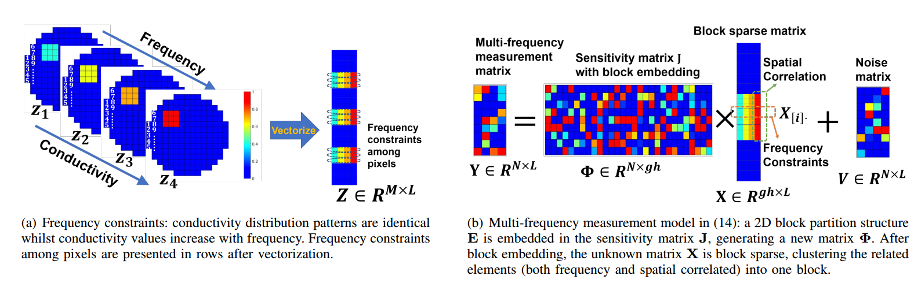

# FCSBL
# [Multi-frequency Electromagnetic Tomography for Acute Stroke Detection Using Frequency Constrained Sparse Bayesian Learning](https://jinxixiang.github.io/files/FCSBL_2020_TMI.pdf) _IEEE Transactions on Medical Imaging, 2020, in press,_
[Jinxi Xiang](https://jinxixiang.github.io/) (Tsinghua University & University of Edinburgh), Yonggui Dong (Tsinghua University), [Yunjie Yang](https://www.yangresearchgroup.com/members) (University of Edinburgh) 

Bioimpedance Imaging Problem
----------

**Two motivations:**
* _Reconstruct multiple measurements simultaneously;_
* _Enhance the reconstructed quality especially when SNR is low._

Proposed FCSBL
---------
Multiple Measurement Model (MMV) + Sparse Bayesian Learning (SBL).

**Benefits:** exploit `spatial correlation` and `frequency correlation` to reconstruct better images.

FC-SBL code
---------
* **Total variation**. In the paper,  DOI: 10.1109/TMI.2009.2022540 is used and the code is available from [EIDORS](http://eidors3d.sourceforge.net/). Here, a more flexible TV method (10.1109/TIP.2009.2028250) is provided.
* **SA-SBL** (DOI: 10.1109/TMI.2018.2816739). I don't have the copyright to make the original SASBL code public. But similar results are demonstrated by feeding in FCSBL with each measurement separately.
* **FCSBL** (proposed)

Running Platform
----------
MATLAB 2019b, 32GB RAM memory, and a 6-core Intel, i7-8700 CPU. Please ensure sufficient RAM capacity, as the MMV model solves problems in higher dimensions.
